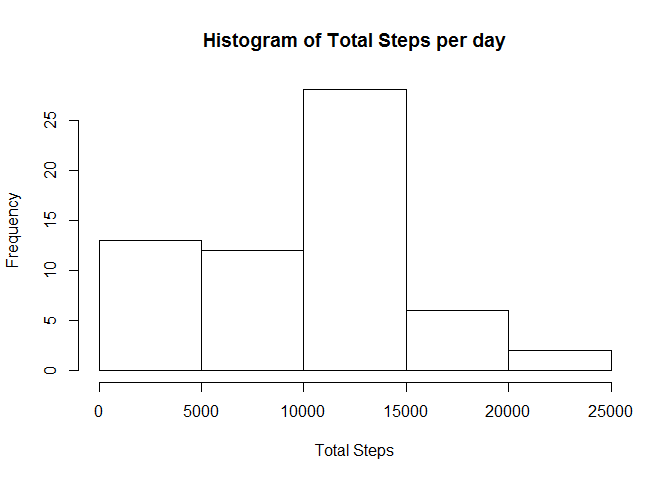
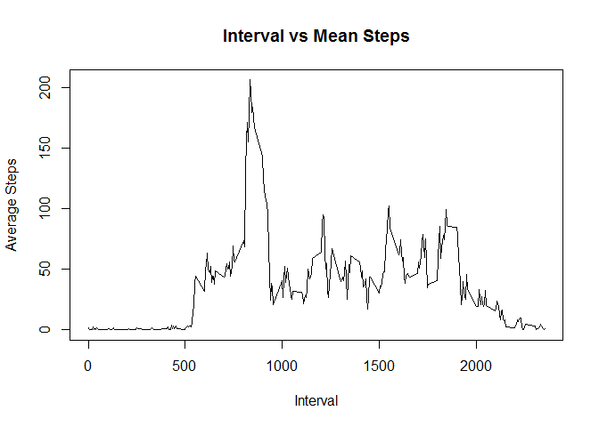
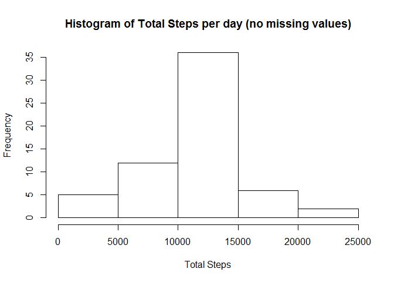

# Reproducible Research: Peer Assessment 1


## Loading and preprocessing the data

```r
# Read file defining the Column types
activity <- read.csv(file = "repdata-data-activity/activity.csv", header = TRUE, na.strings = "NA", colClasses = c("numeric","character","numeric"))

# Change the date column to Date (from character)
activity$date <- as.Date(activity$date, "%Y-%m-%d")
```


## What is mean total number of steps taken per day?

```
## 
## Attaching package: 'dplyr'
```

```
## The following objects are masked from 'package:stats':
## 
##     filter, lag
```

```
## The following objects are masked from 'package:base':
## 
##     intersect, setdiff, setequal, union
```

```r
act_grp <- group_by(activity, date) %>% 
  summarize(TotalSteps=sum(steps,na.rm=TRUE))

# Plotting histogram of total steps
hist(act_grp$TotalSteps, main="Histogram of Total Steps per day", xlab = "Total Steps")
```



```r
# Setting option to limit decimal points to 2
options(scipen = 1, digits = 2)

meanSteps <- mean(act_grp$TotalSteps)
medianSteps <- median(act_grp$TotalSteps)
```
The Mean Total Steps per day is:    9354.23

The Median Total Steps per day is:  10395

## What is the average daily activity pattern?

```r
act_grp <- group_by(activity, interval) %>%
  summarize(avg=mean(steps,na.rm=TRUE))

plot(act_grp$interval,act_grp$avg,type="l",main="Interval vs Mean Steps", xlab = "Interval", ylab = "Average Steps")
```



```r
max_interval <- act_grp[which(act_grp$avg == max(act_grp$avg)),"interval"]
```
Interval with max average number of steps is: 835


## Imputing missing values

```r
num_na <- length(which(is.na(activity$steps)))
```
The number of rows with NA's is: 2304


```r
# Merging the activity and act_grp data frame by interval to add an avg number of steps per inerval column (from avg calculated in previous part)
new_act_grp <- merge(activity, act_grp, by = "interval")
for(i in 1:length(new_act_grp$steps))
{
  # Check if steps is NA, if so assign the avg value to it
  if(is.na(new_act_grp[i, "steps"]))
    new_act_grp[i, "steps"] <- new_act_grp[i, "avg"]
}
# Removing the avg column from DF to achieve DF that is like the original but with non-missing values
new_act_grp$avg <- NULL

# Grouping by date to get total number of steps per day
act_grp_new <- group_by(new_act_grp, date) %>% 
  summarize(TotalSteps=sum(steps))

# Plotting histogram of total steps
hist(act_grp_new$TotalSteps, main="Histogram of Total Steps per day (no missing values)", xlab = "Total Steps")
```



```r
meanSteps_new <- mean(act_grp_new$TotalSteps)
medianSteps_new <- median(act_grp_new$TotalSteps)

# The mean and median converge to the same point, this is because wherever there are missing values in steps, it is missing for the entire day, so the same averages (by interval) are applied causing the sum to be the same
```
The Mean Total Steps per day is:    10766.19

The Median Total Steps per day is:  10766.19

The Difference in Mean Total Steps per day is:    1411.96

The Difference in Median Total Steps per day is:  371.19

## Are there differences in activity patterns between weekdays and weekends?

```r
# Creating new variable in DF with default value Weekday
new_act_grp$wend <- "Weekday"

# Checking if day of week in Sat or Sun, if so, assign value of weekend to the new column wend
new_act_grp[which(weekdays(new_act_grp$date) %in% c("Saturday","Sunday")),"wend"] <- "Weekend"

# Convert the column wend to factor as per requirement
new_act_grp$wend <- as.factor(new_act_grp$wend)

# Create new DF to group by interval and wend to calculate mean steps
weekend_plot <- group_by(new_act_grp, interval, wend) %>%
  summarize(meanSteps=mean(steps))

# Plot as per requirement
with(weekend_plot, xyplot(meanSteps ~ interval | wend, type = "l", layout = c(1,2), xlab = "interval", ylab = "Number of Steps"))
```


